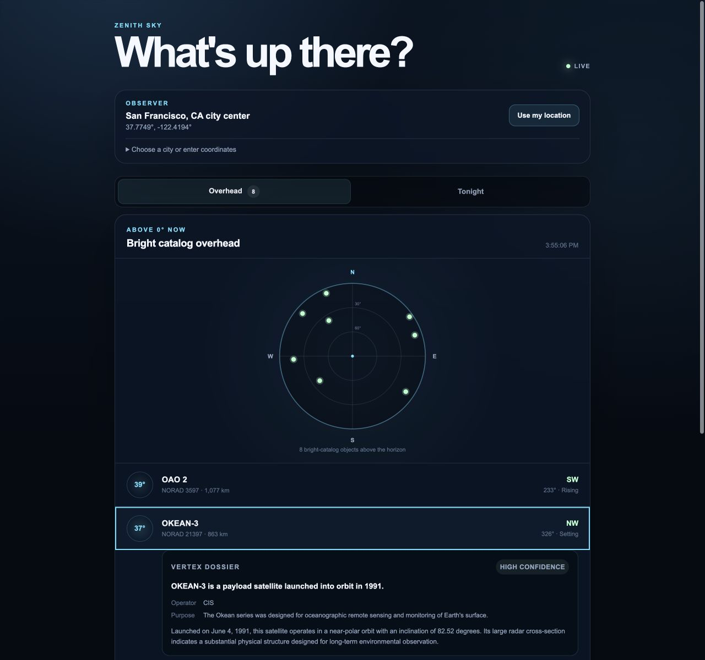
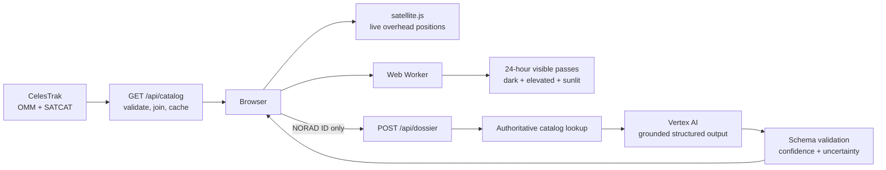

# Zenith Sky

**A phone-first satellite visibility PWA that shows what is overhead now, predicts what may be visible tonight, and uses grounded AI to explain the objects in plain language.**

[Launch Zenith Sky](https://zenith-sky-265050340558.us-central1.run.app/) · Built with Next.js, Vertex AI, Cloud Run, `satellite.js`, and `astronomy-engine`



## What it does

Satellite catalogs are rich in orbital data but difficult to read. Names such as `SL-16 R/B`, owner codes, NORAD identifiers, and raw orbital elements do not immediately answer the question a person looking at the sky actually has: **What is up there?**

Zenith Sky turns that data into an observer-focused experience:

- Shows bright-catalog satellites above the local horizon right now.
- Updates elevation, compass direction, range, and rising/setting state every five seconds.
- Plots the sky north-up, with the horizon outside and zenith at the center.
- Predicts physically plausible visible passes during the next 24 hours.
- Generates a grounded AI dossier when someone wants to understand an object.
- Works with one precise browser location, manual coordinates, or a static U.S. city picker.
- Installs as a standalone PWA on supported devices.

The application tracks only CelesTrak's bright visual catalog. It intentionally avoids accounts, analytics, maps, notifications, continuous GPS, and full-catalog tracking.

## How AI helps

The LLM is an **explanation layer**, not the source of orbital truth.

Orbital propagation can determine that NORAD 21397 is 37° above the horizon to the northwest. That calculation cannot explain why the object matters, what its name means, who operated it, or what it was designed to do. Zenith Sky uses Vertex AI for that interpretive step.

When a user opens a dossier:

1. The browser sends only the object's NORAD ID.
2. The server finds the authoritative object in its validated CelesTrak catalog.
3. Catalog fields such as object type, owner, launch date, orbit, and radar cross-section class ground the prompt.
4. `gemini-3.1-flash-lite` returns a structured brief containing `whatItIs`, `operator`, `purpose`, `story`, and `confidence`.
5. Zod validates the response before it reaches the interface.
6. Successful dossiers are cached in memory and in the browser.

The prompt and post-processing are deliberately conservative. Generic debris and rocket-body records cannot receive invented operators or missions: their nullable fields remain empty and their confidence is forced low. If Vertex AI fails, the interface keeps the catalog facts visible and offers a retry instead of fabricating prose.

### Why this boundary matters

Vertex AI does **not** calculate satellite positions, visible passes, solar geometry, or user location. Those paths remain deterministic and testable:

- `satellite.js` propagates OMM elements and calculates observer look angles.
- `astronomy-engine` supplies solar altitude and the geocentric Sun vector.
- A Web Worker performs the 24-hour pass search without blocking the interface.
- The browser performs current-position calculations locally.

AI is used only where natural-language interpretation provides value. This keeps the product useful without making physical calculations dependent on model output.

## Architecture



### Catalog path

The server fetches only CelesTrak's visual-group OMM and SATCAT JSON feeds. Payloads are validated and joined on `NORAD_CAT_ID`, preserving six-digit identifiers. OMM data is cached for six hours and SATCAT metadata for 24 hours, with request coalescing, paced upstream calls, stale-on-error behavior, and a checked-in snapshot fallback.

The browser does not refetch the catalog every five seconds. It reuses the same elements and advances the calculation time locally.

### Visible-pass path

The worker samples the next 24 hours at 30-second intervals. A sample is considered potentially visible only when all three conditions are true:

- The observer's geometric solar altitude is below −6°.
- The satellite is more than 10° above the horizon.
- A cylindrical Earth-shadow test reports the satellite as sunlit.

Contiguous samples are grouped into passes, and events shorter than 60 seconds are discarded. The result includes start, peak, and end times, elevations, azimuths, directions, duration, and a sky-dome track.

## Privacy and cost controls

- Precise coordinates remain in the browser and are never sent to Cloud Run or Vertex AI.
- Device location is a single high-accuracy request made only after a user action; there is no watching or polling.
- The city picker is a static local dataset, so it creates no Maps Platform requests.
- The dossier route accepts only a NORAD ID; clients cannot supply model-grounding metadata.
- Vertex AI is called only when a dossier is opened and uses minimal thinking with structured output.
- Cloud Run authenticates to Vertex AI through its service identity and Application Default Credentials. No Gemini API key is used.
- The service worker caches same-origin application assets but always bypasses `/api/*`.

## Technology

| Area | Implementation |
| --- | --- |
| Application | Next.js 16 App Router, React 19, TypeScript |
| Orbital mechanics | `satellite.js` with OMM elements |
| Solar geometry | `astronomy-engine` |
| AI explanations | Vertex AI through `@google/genai` |
| Validation | Zod |
| Background work | Typed Web Worker messages |
| Hosting | Google Cloud Run, deployed from source with buildpacks |
| PWA | Web app manifest and API-bypassing service worker |
| Testing | Vitest, Testing Library, Playwright |

## API

### `GET /api/catalog`

Returns the normalized bright-object catalog:

```ts
{
  updatedAt: string;
  stale: boolean;
  objects: CatalogObject[];
}
```

### `POST /api/dossier`

Accepts an authoritative object lookup key:

```json
{ "noradId": "25544" }
```

Returns a validated dossier:

```ts
{
  whatItIs: string;
  operator: string | null;
  purpose: string | null;
  story: string;
  confidence: "high" | "medium" | "low";
}
```

Errors use `{ error: { code, message } }` with an appropriate HTTP status.

## Run locally

Requirements:

- Node.js 22
- npm
- Optional: a Google Cloud project with Vertex AI enabled for live dossiers

```bash
npm install
npm run dev
```

The overhead and Tonight experiences can run without an AI credential. To enable dossiers locally, authenticate with Application Default Credentials:

```bash
gcloud auth application-default login
```

Then create an ignored `.env.local` file:

```dotenv
GOOGLE_CLOUD_PROJECT=your-project-id
GOOGLE_CLOUD_LOCATION=global
GOOGLE_GENAI_USE_VERTEXAI=true
VERTEX_MODEL=gemini-3.1-flash-lite
```

No API key belongs in the repository.

## Verification

```bash
npm run typecheck
npm run lint
npm test
npm run build
npm run test:e2e
```

The suite covers OMM normalization, six-digit NORAD IDs, propagation and look angles, solar geometry, Earth-shadow boundaries, pass grouping, catalog caching and fallbacks, grounded dossier validation, location persistence, worker behavior, PWA registration, and browser acceptance flows.

## Deployment

The production application runs on Cloud Run in `us-central1`. It is deployed manually from source using Google buildpacks, scales to zero, and uses a dedicated service identity with only Vertex AI user access. GitHub is source control only; it is not a deployment trigger.

The model is configured through `VERTEX_MODEL`, and the application uses the Vertex global endpoint. No Firebase project, database, Secret Manager entry, Dockerfile, or Gemini API key is required.

## Limitations

- The catalog is intentionally limited to bright visual objects; it is not a complete space-object tracker.
- Predictions use 30-second sampling and a cylindrical shadow model. They are useful observing guidance, not navigation or safety data.
- Membership in the visual catalog does not guarantee naked-eye visibility. Actual brightness varies with attitude, atmosphere, distance, and observing conditions.
- Radar cross-section is not converted into an invented apparent magnitude.
- AI dossiers are grounded and validated, but generated explanations should still be treated as summaries rather than primary historical sources.
- Server caches are intentionally in memory and may reset when Cloud Run scales to zero.

## Data and acknowledgements

- Orbital elements and catalog metadata: [CelesTrak](https://celestrak.org/)
- Orbital propagation: [satellite.js](https://github.com/shashwatak/satellite-js)
- Solar-system calculations: [Astronomy Engine](https://github.com/cosinekitty/astronomy)
- Structured object explanations: [Vertex AI](https://cloud.google.com/vertex-ai/generative-ai/docs)
- Hosting: [Google Cloud Run](https://cloud.google.com/run)

Zenith Sky is a personal portfolio project exploring the boundary between deterministic scientific computation and responsible, grounded generative AI.
